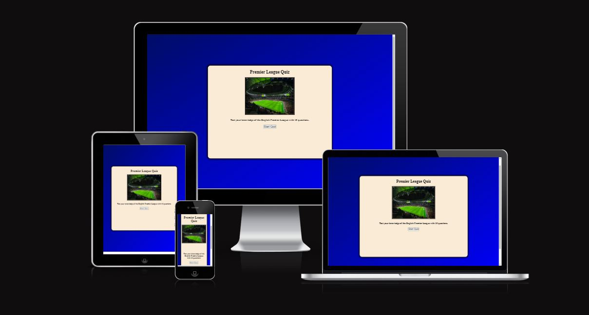
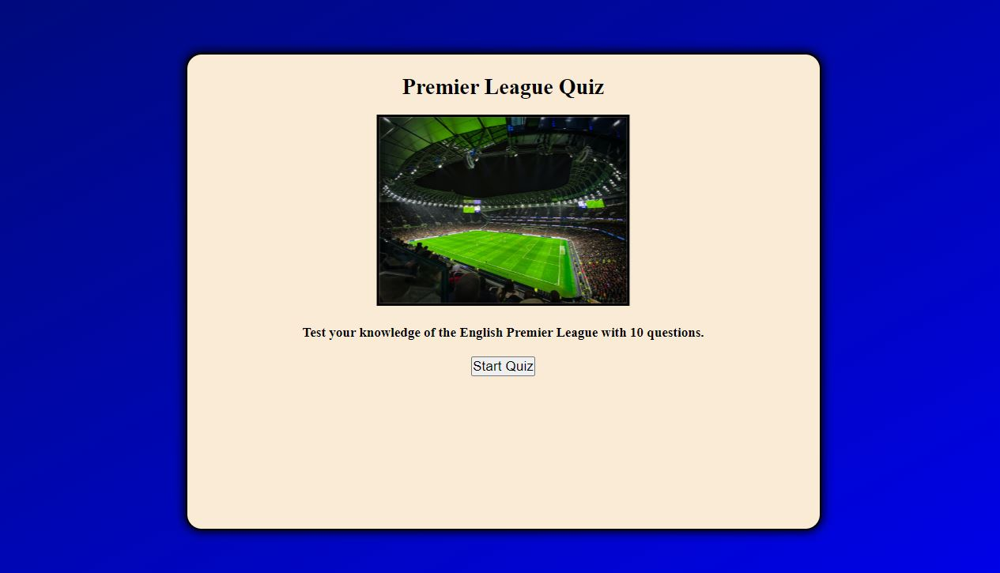
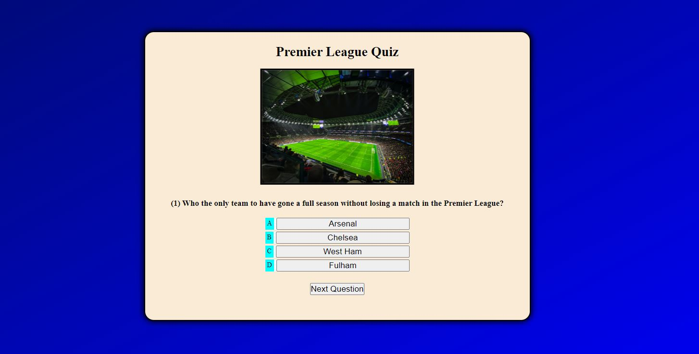
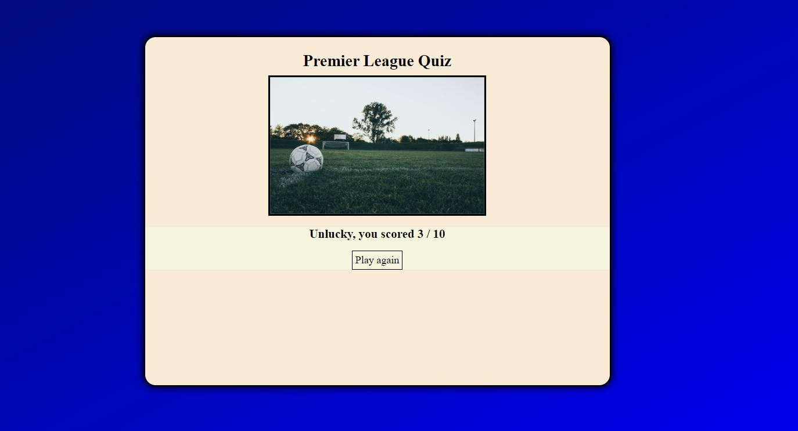

# Premier league quiz
This is quiz website based on the English premier league. The website page can be found here. [Premier League Quiz](https://thomas-longworth.github.io/Premier-League-quiz-pp2/index.html)

## Features

### Main Screen

- This section includes the start screen. The user is able to start the game by pressing the start button.

### Quiz questions section

- This is the area where the 10 questions are displayed for the user.

### End game screen

THis is the screen when the user has finished the quiz. It displays a picture and the number of correct questions the user had.

## Testing

- I made sure that the page loads in different browsers. I used inspect element to scale the page down and check how responsive it was to different screen sizes

## Validator Testing

- HTML:
I copied and pasted my HTML code into the W3C validator and fixed all the errors it showed.
- CSS:
I alsoe copied and pasted my CSS code with the W3C CSS validator and fixed all the errors it showed.
- Accessibility: 
I used Lighthouse in the dev tools and generated a score of 86%.
- Javascript: 
Using JSHint, I was able to check my javascript file for errors. I was able to fix all the syntax errors.

## Deployment

- I deployed this website using Github pages.
1. In the github page for the repository, go to the pages tab in settings.
2. From the source, select Main in Branch and save it.
3. Refresh page.

- The website can be reached here: [English Premier League](https://thomas-longworth.github.io/Premier-League-quiz-pp2/index.html)

## Credits

#### Content
-For the Javascript, I got some ideas for quiz games from Web Dev Simplified on Youtube.

#### Media
- The photos used in the Main screen section and End game section are taken from Pexels.com.
